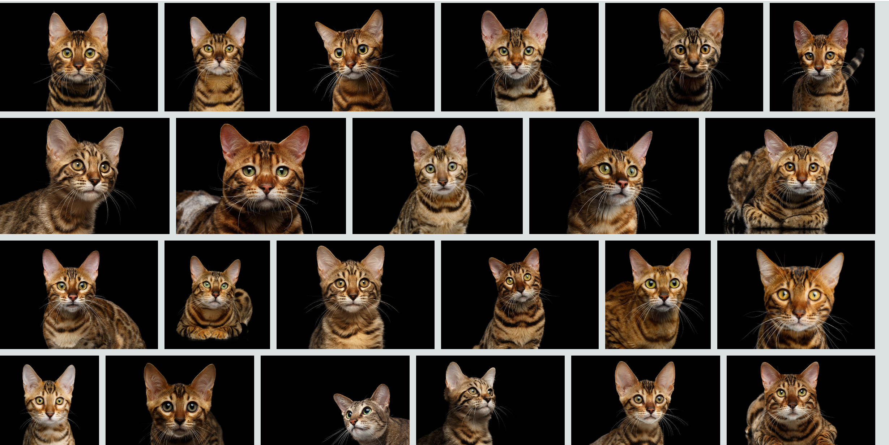
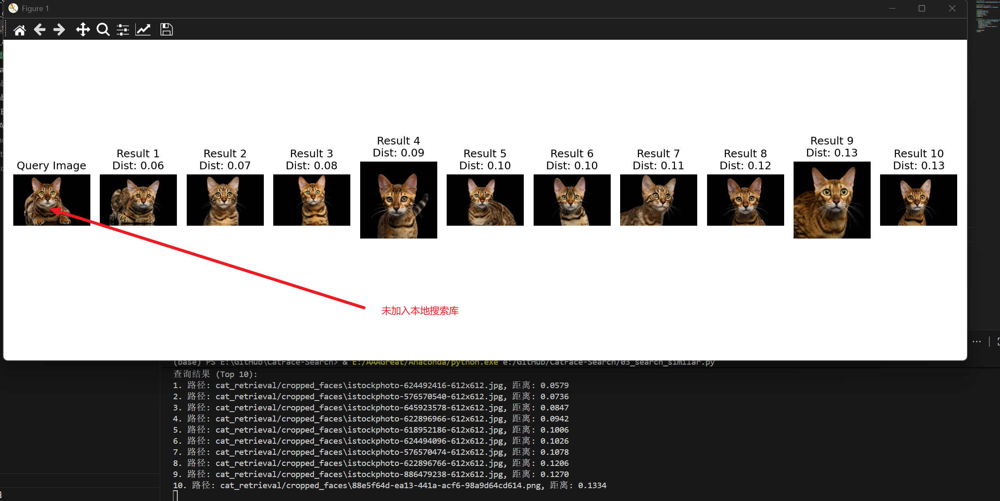

# CatFace Search: 猫脸视觉相似性搜索引擎

## 效果展示

<p align="center">
  
  <br/>
  
</p>

## 📜 项目简介

[](LICENSE)


这是一个基于深度学习的“以图搜图”引擎，专门用于在大型数据集中快速查找视觉上相似的猫脸。项目核心特点在于其**可扩展性**：当有新的猫咪照片加入时，**无需重新训练任何模型**，只需更新索引即可。

## 🧠 核心原理：从“识别”到“测量相似度”

传统的身份识别系统通常需要“监督学习”，即用大量标注好身份（例如，“猫 A”、“猫 B”）的数据去训练一个分类模型。这种方法的缺点是每当有新猫加入，就需要重新训练整个模型。

本项目巧妙地绕开了这个问题，其核心思想是**将“识别问题”转化为“在高维空间中测量相似度”的数学问题**：

1.  **利用“视觉专家”而非“训练”**：我们使用了一个在 ImageNet 上预训练好的`ResNet-50`模型。这个模型已学会理解图像的通用视觉特征，就像一个通用的“视觉翻译官”。

2.  **将图片“翻译”成“面部指纹”**：我们利用这个“翻译官”将每一张猫脸图片，转换成一个 2048 维的数字向量，即**特征向量 (Embedding)**。这个向量可以被看作是这张脸独一无二的“面部指纹”。

3.  **在“特征空间”中寻找最近邻**：这个 2048 维的向量可以被想象成一个点在拥有 2048 个坐标轴的超高维“特征空间”中的位置。在这个空间中：

    - **视觉上相似的图片，其对应的点会非常接近。**
    - **视觉上差异大的图片，其对应的点会相距遥远。**

4.  **“识别”效果的涌现**：系统本身并不知道“身份”的概念。但基于一个强假设——**“同一只猫的不同照片，其视觉特征的相似度远高于它和其它猫的相似度”**——当我们用一张猫的照片去搜索时，系统通过`FAISS`库在这个高维空间中快速找到距离最近的点。这些“最近邻”在绝大多数情况下都恰好是同一只猫的其他照片，从而达到了“识别”的效果。

## ✨ 项目特点

- **🚀 自动化数据预处理**: 使用先进的 **YOLOv9** 模型自动从原始图片中检测并裁剪出猫脸。
- **🧠 鲁棒的深度特征**: 利用 **测试时增强 (TTA)** 技术，为每张图片及其翻转版本生成特征并取平均，显著提升了特征向量对姿态变化的鲁棒性。
- **⚡️ 闪电般快速的搜索**: 集成 Facebook AI 的 **FAISS** 库，为特征向量建立高效索引，实现毫秒级的相似性搜索。
- **⚡️ 高性能批处理**: 所有特征生成和更新脚本都经过优化，采用**批处理**方式，能高效处理大规模数据集。
- **📈 强大的可扩展性**: 无需重新训练，即可轻松向数据库中添加新的猫脸图片，系统能够智能地进行增量更新。
- **🛠️ 易于维护**: 提供独立的、经过优化的工具脚本用于数据库的创建、更新和清理。

---

## 📂 项目结构

```
cat-face-search/
├── yolov9/                      # YOLOv9 官方仓库代码
│   ├── yolov9-e.pt              # YOLOv9 预训练权重 (需自行下载)
│   └── ...
├── pretrained_models/           # 存放本地化的预训练模型
│   └── resnet50-weights.pth     # ResNet-50 权重 (由脚本生成)
├── cat_retrieval/               # 数据集目录
    ├── raw_images/                  # 存放原始猫咪图片
    ├── cropped_faces/               # 存放由YOLOv9裁剪出的猫脸
├── query/                       # 存放用于搜索的查询图片
│
├── download_model.py            # [新增] 脚本：下载ResNet-50模型到本地
├── 01_crop_faces.py     # 脚本：高效、不重复地裁剪猫脸
├── 02_generate_embeddings.py  # 脚本：高性能地从头创建特征数据库
├── 03_search_similar.py       # 脚本：执行一次高性能的相似性搜索
├── 04_add_new_cat.py      # 脚本：高性能地增量更新数据库
├── clean_database.py    # 脚本：高效地清理数据库中的无效记录
│
├── embeddings_tta.pkl           # 生成的特征数据库文件
├── LICENSE                      # MIT 许可证
└── README.md                    # 本说明文件
```

---

## 🚀 安装与配置

推荐使用 `Anaconda` 或 `Miniconda` 创建独立的虚拟环境。

### 1. 克隆仓库并设置环境

```bash
# 1. 克隆本项目和YOLOv9仓库
git clone https://github.com/424635328/cat-face-search.git
cd cat-face-search
git clone https://github.com/WongKinYiu/yolov9.git

# 2. 创建并激活Conda虚拟环境
conda create --name cat-vision python=3.10 -y
conda activate cat-vision

# 3. 安装PyTorch
# 访问 PyTorch官网 (https://pytorch.org/get-started/locally/) 获取适合你系统的命令
# 例如，使用CUDA 11.8:
conda install pytorch torchvision torchaudio pytorch-cuda=11.8 -c pytorch -c nvidia

# 4. 安装其他核心依赖
# 重要：由于兼容性问题，我们需手动指定NumPy版本<2.0
pip install "numpy<2.0"
pip install opencv-python tqdm matplotlib pillow

# 5. 安装FAISS
# 如果你有NVIDIA GPU (推荐)
conda install -c pytorch faiss-gpu
# 如果你只有CPU
# conda install -c pytorch faiss-cpu

# 6. 安装YOLOv9的依赖
cd yolov9
pip install -r requirements.txt
cd ..
```

### 2. 下载预训练模型

本项目依赖两个预训练模型，请按以下步骤下载：

1.  **下载 YOLOv9 模型**:
    从 [YOLOv9 Release 页面](https://github.com/WongKinYiu/yolov9?tab=readme-ov-file#evaluation) 下载权重文件（如 `yolov9-e.pt`），并将其放入 `yolov9/` 文件夹内。

2.  **下载并本地化 ResNet-50 模型**:
    运行 `download_model.py` 脚本，它会自动下载 ResNet-50 的权重并保存到 `pretrained_models/` 文件夹中，以供离线使用。
    ```bash
    python download_model.py
    ```

---

## ⚙️ 使用方法

### 第 1 步: 准备原始图片

将你收集的所有猫咪图片放入 `raw_images/` 文件夹。

### 第 2 步: 裁剪所有猫脸

运行优化后的 `01_crop_faces.py` 脚本。它会跳过已存在的图片，只处理新图片。

```bash
python 01_crop_faces.py
```

### 第 3 步: 建立初始特征数据库

运行高性能的 `02_generate_embeddings.py` 脚本，创建包含 TTA 特征的数据库。

```bash
python 02_generate_embeddings.py
```

### 第 4 步: 执行相似性搜索

1.  将一张你想要搜索的猫脸图片放入 `query/` 文件夹。
2.  修改 `03_search_similar.py` 脚本中的 `QUERY_IMAGE_PATH` 变量。
3.  运行脚本，结果将以图片形式展示。

```bash
python 03_search_simila.py
```

---

## 🔄 如何添加新的猫咪图片 (工作流)

当你有新的猫咪照片时，请遵循以下**增量更新**流程：

1.  **添加新图片**: 将新的原始照片放入 `raw_images/` 文件夹。
2.  **裁剪新面孔**: 再次运行裁剪脚本，它只会处理新加入的图片。
    ```bash
    python 01_crop_faces_optimized.py
    ```
3.  **智能更新数据库**: 运行 `04_add_new_cat.py` 脚本。它会自动为新裁剪出的猫脸生成 TTA 特征，并追加到数据库中。
    ```bash
    python 04_add_new_cat.py
    ```
    现在，你的搜索引擎就已经包含了这些新猫的信息！

---

## 🛠️ 维护工具

如果数据库中存在指向已删除文件的无效记录，运行 `clean_database.py` 进行清理。

```bash
python clean_database.py
```

## 💡 未来与当前工作

- **当前正在进行**:

  - **微调 YOLOv9 猫脸检测器**: 当前的 YOLOv9 模型是用于检测猫全身的，裁剪出的区域可能包含身体和背景，从而“污染”特征。我们正在使用专门的猫脸数据集来微调 YOLOv9，使其能够**精准地只裁剪出猫脸**。这将是提升系统准确率的关键一步。

- **未来可改进的方向**:
  - **Web 界面**: 使用 Flask 或 Gradio 为项目创建一个用户友好的 Web 界面。
  - **微调特征提取器**: 在获得精准的猫脸数据后，可以使用度量学习（如 Triplet Loss）来微调 ResNet-50 模型，使其生成的特征向量更能区分不同的猫咪个体。
  - **数据库后端**: 对于超大规模数据集，可以考虑将特征向量存储在专门的向量数据库中（如 Milvus, Weaviate）。

---

## 📄 许可证

本项目采用 [MIT License](LICENSE) 授权。
