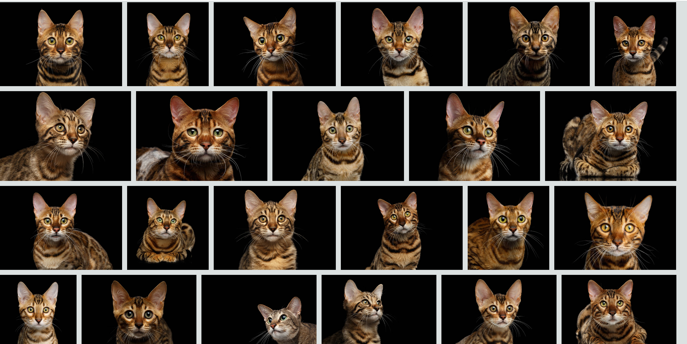

# CatFace Search — 猫脸身份检索系统

<p align="center">
  
</p>

[](LICENSE)


一个"以图搜猫"引擎：给一张猫脸照片，在库里找出**同一只猫**的其他照片。

核心设计目标是**可扩展性**——加入新猫不需要重新训练，只需增量更新索引。

---

## 📊 实测效果

在 **503 个未参与训练**的猫个体、12 141 张画廊图的检索协议上（完整报告见 [`docs/BENCHMARK.md`](docs/BENCHMARK.md)）：

| 配置 | 参数量 | hit@1 | hit@5 | mINP | 嵌入耗时 |
|---|---|---|---|---|---|
| 旧版骨干 ResNet-50（ImageNet 预训练） | 25.6 M | 0.8867 | 0.9364 | 0.2882 | 95 s |
| DINOv2-S 零样本 | 21 M | 0.9344 | 0.9742 | 0.3945 | 121 s |
| DINOv2-B 零样本 | 86 M | 0.9523 | 0.9801 | 0.4352 | 326 s |
| **DINOv2-S + ArcFace 微调** | **21 M** | **0.9682** | **0.9881** | **0.7686** | **121 s** |
| DINOv2-B + ArcFace 微调 | 86 M | 0.9583 | 0.9861 | 0.7219 | 271 s |

配对 bootstrap 显著性检验：微调 DINOv2-S 相对 ResNet-50 **+8.15 个点**（95% CI [+5.96, +10.44]，p<0.001）。嵌入耗时是 12 644 张图的总时长。

三点值得注意：

1. **21 M 的微调 DINOv2-S 比 4 倍大的 86 M 微调 DINOv2-B 还高 1.0 个点**，且嵌入快 2.2 倍、训练少 13 分钟。收益来自让训练目标与检索任务对齐（自监督优化"这是什么"，ArcFace 优化"这是哪一只"），**不是**来自模型容量——在 352 个身份的训练集上，大骨干的额外容量没被用上。
2. **mINP 提升 2.7 倍**，说明正确的匹配不只是"出现在列表里"，而是排得足够靠前。
3. **代价已量化**：身份训练会压缩通用视觉组织能力——物种可分间隔下降 64%，品种 1-NN 从 0.9506 降到 0.7881。详见 [`docs/BENCHMARK.md`](docs/BENCHMARK.md) §5。

---

## ⚠️ v2 重要更正

本次升级修掉了旧版中的两处**实质性错误**，它们让项目此前的结论不成立：

| 问题 | 旧版 | v2 |
|---|---|---|
| **Oxford-IIIT Pet 被当作身份数据集** | README 声称可从中获得身份信息 | 已核实：其文件名前缀是**品种**（12 个），`list.txt` 是 `CLASS-ID 1..37`。**该数据集只有品种标注，没有个体标注**，无法用于个体识别训练/评测。详见 [`docs/data-findings.json`](docs/data-findings.json) |
| **CALFW 被当作猫脸验证基准** | 用作验证数据集 | 已核实：该 split 的 6000 张图**100% 是人脸**（YuNet 人脸检测器 300/300 命中，均值置信度 0.92）。详见 [`docs/diagnostics/CALFW-IS-NOT-CAT-FACES.md`](docs/diagnostics/CALFW-IS-NOT-CAT-FACES.md) |

两处都保留了完整审计证据链。**这些数据集的名称与 dataset card 不构成其内容的证据。**

---

## 🧠 原理

不训练分类器，而是把"识别"转化为"在高维空间测距离"：

1. **用度量学习而非分类** — ImageNet 分类器优化的是"类间线性可分"，对**类内方差**没有约束。同一只猫的不同照片在该空间里可以随意散开。身份检索需要的是"类内紧凑"，这是一个不同的目标函数。
2. **把脸变成指纹** — 骨干网络把每张猫脸映射为单位范数向量（embedding）。
3. **在指纹空间找最近邻** — FAISS 索引毫秒级返回最相似的脸。
4. **身份从几何中涌现** — 系统不知道"身份"概念，但同一只猫的向量天然聚在一起。

正因为不需要训练分类器，**加入新猫只需更新索引，无需重新训练**。

---

## 🏗️ 架构

```
cat_retrieval/                     data/（原始数据 + 各类派生数据）
├─ raw_images/   原始猫图           ├─ oxford_annotations/   OIID 标注（含头部框）
└─ cropped_faces/ 裁剪后的猫脸      ├─ raw/                  下载的原始语料
                                    ├─ faces/                标准化后的 256×256 脸块
                                    └─ manifests/            清单 + 身份隔离划分

src/catface/                       企业级包结构
├─ config.py          类型化配置（未知键报错、指纹可追溯）
├─ errors.py          异常层级
├─ logging_utils.py   结构化日志 + 环境指纹
├─ data/
│  ├─ sources.py      数据集目录、完整性校验下载、安全解压
│  ├─ annotation.py   标注解析（OIID XML、pair parquet）
│  ├─ cropping.py     裁剪几何 + 质量信号
│  ├─ manifest.py     清单 + **按身份**划分 + 泄漏检测
│  └─ prepare.py      各语料 → 脸块清单
├─ models/
│  ├─ backbone.py     骨干注册表（可扩展）
│  ├─ pooling.py      池化（auto/gap/gem/cls/cls_gap）
│  ├─ heads.py        ArcFace / CosFace / SubCenter / Triplet
│  └─ embedder.py     统一推理入口（训练与推理不漂移）
├─ train/loop.py      PK 采样 + 分层学习率 + EMA + 按检索指标选模型
├─ eval/
│  ├─ metrics.py      R@k / fullRecall@k / mAP / mINP / mRR / AUC / EER / TAR@FAR
│  ├─ postprocess.py  PCA白化 / DBA / αQE（免训练提点）
│  ├─ protocols.py    查询/画廊协议 + 身份泄漏断言
│  └─ benchmark.py    统一评测循环 + 配对 bootstrap 显著性检验
├─ index/faiss_index.py  FAISS 索引（带 NumPy 回退，两者结果一致）
└─ cli.py             catface doctor/acquire/prepare/train/benchmark/verify/index
```

---

## 🚀 快速开始

> 本节每条命令都在本机实测通过。**注意**：数据统一放在 `data/`，所有相对路径都相对你执行命令的目录解析。

### 第 0 步：环境

```powershell
# 从仓库根目录执行
python -m venv .venv
.\.venv\Scripts\Activate.ps1                  # PowerShell（Windows）
# source .venv/bin/activate                   # bash（Linux / macOS）

pip install -e ".[benchmark,dev]"             # 完整功能；纯 CPU 用 ".[cpu]"

# PyTorch + CUDA 请按官网指引单独安装，例如 CUDA 12.4：
# pip install torch torchvision --index-url https://download.pytorch.org/whl/cu124
```

确认装好了（这一步不做任何修改，只报告设备、库版本、数据就绪度）：

```powershell
catface doctor
```

正常情况下会看到 `"issues": []` 和你的设备（如 `"device": "cuda"`）。如果你没激活虚拟环境，把上面的 `catface` 换成 `python -m catface.cli`。

---

### 路线 A：只想跑搜索（最快，约 5 分钟）

需要三样东西：**一个训练好的模型**、**一份索引清单**、**一张要搜的图**。

```powershell
# 1. 建索引：把 400 张图嵌成向量（用仓库自带的猫脸清单）
catface index --checkpoint artifacts/train/dinov2s-arcface/best.pt `
              --manifest data/manifests/cat_individuals_manifest.jsonl `
              --kind flat_ip

# 2. 查询：传入任意一张猫脸照片
catface index --checkpoint artifacts/train/dinov2s-arcface/best.pt `
              --manifest data/manifests/cat_individuals_manifest.jsonl `
              --query query/my_cat.jpg --top-k 10
```

输出是每个邻居的 `identity` 与 `similarity`。**取 `top-1` 的 `identity` 就是系统判断的猫**；若 top-k 里 `identity` 一致，说明该身份可靠。

> 模型太大不适合入库（86 MB / 334 MB），所以 **`artifacts/train/` 与训练数据都不在仓库里**。若你的克隆里没有 `best.pt`，走路线 B 自己训一个，或从 Release 下载。

---

### 路线 B：从零复现完整实验（含数据获取与训练）

必须先配 Kaggle 凭据——训练用的个体身份数据托管在 Kaggle：

```powershell
# 1. 到 https://www.kaggle.com/settings 生成 API Token，得到 kaggle.json
# 2. 放到 %USERPROFILE%\.kaggle\kaggle.json
# 3. 导出为环境变量（工具会读这两个变量，不要把 key 写进代码）
$env:KAGGLE_USERNAME = "你的用户名"
$env:KAGGLE_KEY      = "你的key"
```

然后：

```powershell
# 4. 下载 13 106 张猫脸 / 509 只个体（11.2 GB）
#    这一步用多流并行下载器：实测 12 并发可达 13.8 MB/s，单流只有 2.2 MB/s
#    （见 docs/HISTORY.md 与「常见错误」一节：不要用 curl 单流下这个文件）
python -m tools.parallel_download `
  --url "https://www.kaggle.com/api/v1/datasets/download/timost1234/cat-individuals" `
  --out "data/raw/kaggle_cat_individuals/cat-individuals.zip" `
  --basic-auth "$($env:KAGGLE_USERNAME):$($env:KAGGLE_KEY)" `
  --workers 12 --chunk-mb 16

# 5. 解压
python -c "import zipfile; zipfile.ZipFile('data/raw/kaggle_cat_individuals/cat-individuals.zip').extractall('data/raw/kaggle_cat_individuals/extracted')"

# 6. 裁剪/缩放猫脸 + 建清单 + 按身份划分（无重叠）
python -m catface.cli prepare --source cat_individuals

# 7. 训练（可随时暂停、断点续训；本机约 34 分钟，早停后 15 轮）
python -m tools.train_embedder --backbone dinov2_vits14 --epochs 20 --lr 1e-3 `
  --identities-per-batch 16 --samples-per-identity 4 --image-size 224 `
  --num-workers 4 --early-stop-patience 8 `
  --output artifacts/train/dinov2s-arcface

# 8. 基准对照（基线 vs 微调，含配对 bootstrap 显著性检验）
python -m tools.run_benchmark_suite --protocol cat_individuals
```

第 7 步若被打断，加 `--resume` 接着跑；想限定单次时长用 `--max-seconds 3600`。详见下面「训练可随时暂停与续训」。

---

### 路线 C：用你自己的猫照建库

```powershell
# 1. 把猫照放进 data/raw_images/<每只猫一个文件夹>/
#    data/raw_images/mimi/*.jpg
#    data/raw_images/doudou/*.jpg
#    目录名就是身份标签。

# 2. 建清单（用 --root 指向你自己的目录）
python -m tools.analyze_corpus --root data/raw_images --out data/raw_images/analysis.json

# 3. 建索引并查询
catface index --checkpoint artifacts/train/dinov2s-arcface/best.pt `
              --manifest data/manifests/cat_individuals_manifest.jsonl `
              --query data/raw_images/mimi/new_photo.jpg --top-k 10
```

> 加入新猫**不需要重新训练**——这是本项目的核心设计：只需重建索引。

---

### 如果你是来改代码的：克隆后先做这两件事

**1. 安装 git 守卫（一次即可）**

本仓库用 `git add . && git push` 同步到公开远端，因此以下三类错误一旦推送就**不可撤销**，已做成提交时自动拦截：机器特有绝对路径、凭据赋值、>5 MB 的大文件。

```powershell
.\tools\install-git-hooks.ps1
```

细节与三层防线的分工见 [`docs/HYGIENE.md`](docs/HYGIENE.md)。

**2. 推送前跑一次自检（约 100 秒）**

```powershell
.\tools\preflight.ps1              # 就是 CI 的四类检查，带完全相同的 flag
.\tools\preflight.ps1 -SkipTests   # 约 2 秒，只查 lint / 配置 / 跟踪状态
```

一次失败的 CI 要花两个来回（推送 → 排队 → 失败 → 修 → 再推）。本仓库第一次真实 CI 运行 5 个 job 里 3 个失败，而**全部能在推送前本地发现**——三个坑都是"本地检查与 CI 接近但不相同"，详见 [`docs/PASS-CI-FIRST-TRY.md`](docs/PASS-CI-FIRST-TRY.md)。

**3. 之后同步就双击 `s.bat`**

`s.bat` 不再裸跑 `git add . && git push`，它调用 `tools\sync.ps1`：**先 preflight，过了才 pull / commit / push**。自检不过就什么都不提交、不推送。

```powershell
.\s.bat                                          # 双击等价，带自检
pwsh -File tools\sync.ps1 -SkipPreflight         # 确实需要绕过时（会打印警告）
pwsh -File tools\sync.ps1 -Message "fix: ..."    # 自定义提交信息
```

---

### 常用入口一览

| 我想…… | 命令 |
|---|---|
| 确认环境与数据就绪 | `catface doctor` |
| 裁剪猫脸、建清单、按身份划分 | `python -m catface.cli prepare --source cat_individuals` |
| 训练（可暂停续训） | `python -m tools.train_embedder --backbone dinov2_vits14 --output artifacts/train/run1` |
| 训练到一半接着跑 | 同上加 `--resume` |
| 基准对照 + 显著性检验 | `python -m tools.run_benchmark_suite --protocol cat_individuals` |
| 后处理调参（val 选参 / test 报告） | `python -m tools.tune_postprocess --checkpoint artifacts/train/dinov2s-arcface/best.pt` |
| 建索引 / 查询 | `catface index --checkpoint <ckpt> --manifest <manifest> --query ` |
| 审计一份新数据源（是不是猫脸） | `python -m tools.audit_species --directory <dir>` |
| 语料统计 | `python -m tools.analyze_corpus --root <dir>` |
| 推送前自检（省一整个 CI 回合） | `.\tools\preflight.ps1` |
| 自检 + 同步一条龙 | `.\s.bat`（等价 `pwsh -File tools\sync.ps1`） |

---

### 常见错误

| 现象 | 原因 | 解决 |
|---|---|---|
| **`catface acquire --datasets oxford_iiit_pet` 下载到约 10 MB 就停住/截断** | Oxford 主机在 ~10 MB 处断开连接**且拒绝 Range 请求**，任何断点续传工具都救不了 | 别用这个端点。训练所需的个体身份数据用路线 B 的 Kaggle 数据集；另外请注意 **Oxford-IIIT Pet 只有品种标签、没有个体标注**，本来就不能用于个体识别训练（见 [`docs/data-findings.json`](docs/data-findings.json)） |
| **用 `curl` 或 `Invoke-WebRequest` 下 Kaggle 那个 11 GB 文件，速度只有 ~2 MB/s 或反复重试失败** | 该端点**按连接限速**，且代理约 10 MB 截断 | 用 `tools/parallel_download.py`（多流分块）。实测单流 2.2 MB/s、12 并发 13.8 MB/s |
| **`catface train` 报找不到 `oiid_cat_manifest.jsonl`** | `catface train` 是 OIID 品种预设，不是个体身份训练 | 用 `python -m tools.train_embedder`（路线 B 第 7 步） |
| **`catface` 命令找不到** | 虚拟环境没激活 | `python -m catface.cli <命令>` 等价可用 |
| **`ModuleNotFoundError: No module named 'catface.data'`** | 曾由 `.gitignore` 的 `data/` 误伤源码包导致；若在旧克隆上遇到，`git pull` 即可 | 已修复（见 [`docs/HYGIENE.md`](docs/HYGIENE.md)） |
| **训练 loss 一直不降** | 历史缺陷：fp16 梯度溢出导致更新被静默丢弃；以及 `grad_clip` 过小 | 已修复：改用 bf16、`grad_clip=10`。若自行改配置请保留这两项（见 [`docs/BENCHMARK.md`](docs/BENCHMARK.md) §7） |
| **显存不足（6 GB 卡）** | batch 过大 | 加 `--gradient-checkpointing`，或把 `--identities-per-batch` 从 16 降到 8 |

---

## 📊 评测报告

每次 benchmark 产出 `artifacts/benchmarks/<run>/`：

- `summary.md` — 可直接贴进评审的对照表
- `metrics.json` — 完整指标 + **环境指纹**（commit、库版本、GPU）+ 协议描述 + split 内容哈希

报告包含：

| 指标族 | 指标 | 回答的问题 |
|---|---|---|
| 检索 | `R@k` | 前 k 张里有没有同一只猫？ |
| 检索 | `fullRecall@k` | 这只猫的所有照片，找回了多少比例？ |
| 检索 | `mAP@k`、`mINP`、`mRR` | 排序质量（mINP 在 mAP 饱和后仍能区分模型） |
| 验证 | `ROC-AUC`、`EER` | 阈值无关的整体判别质量 |
| 验证 | `TAR@FAR` | **在 1% 误接受预算下，漏掉了多少真匹配？** |
| 统计 | 配对 bootstrap | 提升是真的，还是抽样噪声？ |

> `R@k` 与 `fullRecall@k` 是两个不同的问题（前者是命中率 CMC，后者是召回比例），混淆二者是检索评测最常见的夸大来源，因此分开报告。
> 配对 bootstrap 用**相同查询**重采样，抵消共同难度，能检出单向重采样检不出的差异。

---

## 🛠️ 维护工具

```bash
pytest -q -m "not slow"          # 单元测试（无网络、无 GPU 依赖）
ruff check --no-respect-gitignore src tests tools   # 静态检查（flag 与 CI 一致）
catface doctor                    # 环境与数据就绪度
python -m tools.audit_species     # 审计语料是否含人脸（新数据源必过）
python -m tools.audit_content     # 审计语料内容类别
python -m tools.parallel_download # 多流并行下载（代理限速时提速约 5 倍）
python -m tools.analyze_corpus    # 语料统计（规模/分辨率/质量/物种构成）
python -m tools.analyze_species_recognition  # 全物种识别统计（跨物种可分性）
python -m tools.run_benchmark_suite  # 一键跑完整基准并出报告
python -m tools.check_docs         # 校验文档里引用的路径真实存在（防文档腐化）
```

同步脚本 `tools/sync.ps1`（`s.bat` 调用它）按固定顺序执行：**preflight → pull → commit → push**。顺序是有意的：先验证本地树，再拉取，这样一次 pull 带来的改动不会在未检查的情况下被推出去；`commit` 时还会再过一道 pre-commit hook，与 preflight 相互独立。
## ⏸️ 训练可随时暂停与续训

每个 epoch 结束都会原子化检查点，中断不丢进度、续训轨迹与不中断时一致（状态含优化器动量、调度器位置、采样器 epoch、RNG）：

```bash
# 带时间预算运行，到点自动在 epoch 边界干净停下
python -m tools.train_embedder --backbone dinov2_vits14 --epochs 20 \
  --output artifacts/train/dinov2s-arcface --max-seconds 3600

# 接着上次继续（同一条命令加 --resume）
python -m tools.train_embedder --backbone dinov2_vits14 --epochs 20 \
  --output artifacts/train/dinov2s-arcface --resume
```

| 暂停方式 | 触发 |
|---|---|
| 时间预算 | `--max-seconds <秒>` |
| 信号 | `Ctrl-C` / SIGTERM（在 epoch 边界停，不再中途硬杀） |
| 外部请求 | 在输出目录放 `PAUSE` 文件 |
| 续训 | `--resume` |

也可用 `tools/train_resumable.ps1` 自动循环续训。暂停**不会**被标记成"早停收敛"（用独立的 `pause_reason` 区分），且暂停时保留**最新**权重而非最佳权重——否则续训轨迹会与不中断时不同。

---

## 📄 许可证

MIT，见 [LICENSE](LICENSE)。

使用的数据集各有其许可，详见 `tools/` 与 `catface/data/sources.py` 中的元数据。**Oxford-IIIT Pet 与 CALFW 仅供研究使用**，图像版权归原始来源所有。
